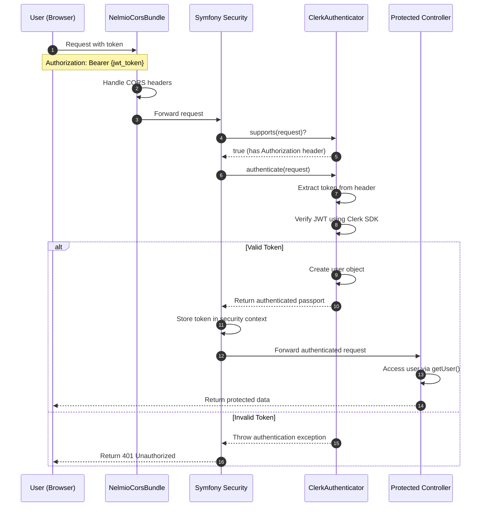

# Clerk Symfony Example

Integration of [Clerk](https://clerk.com/) authentication with Symfony 7 backend.

## Features

- JWT token validation
- Symfony security integration
- Protected API endpoints
- CORS support

## Authentication Flow



## How Authentication Works

1. **Token Validation**: When a request arrives with a Bearer token, the `ClerkAuthenticator` validates it using Clerk's SDK.

2. **Endpoint Protection**: Symfony endpoints are protected in two ways:
   - Access Control Lists in `security.yaml` protect entire URL patterns
   - Individual controller methods use `#[IsGranted('IS_AUTHENTICATED_FULLY')]` attribute to require authentication

3. **User Identity**: After successful authentication, controllers can access the user identity via `$this->getUser()->getUserIdentifier()`.

## Setup

1. Install dependencies:
```bash
composer install
```

2. Configure in `.env.local`:
```
CLERK_SECRET_KEY=your_clerk_secret_key
CLERK_AUTHORIZED_PARTIES=http://localhost:5173
```

3. Start server:
```bash
symfony server:start
```

## Usage

From a React application:

```javascript
import { useAuth } from '@clerk/clerk-react';

function ApiExample() {
  const { getToken } = useAuth();
  
  const fetchData = async () => {
    const token = await getToken();
    
    const response = await fetch('http://localhost:8000/api/get-gated', {
      headers: {
        'Authorization': `Bearer ${token}`
      }
    });
    
    if (response.ok) {
      const data = await response.json();
      console.log(data);
    }
  };
  
  return <button onClick={fetchData}>Fetch Data</button>;
}
``` 