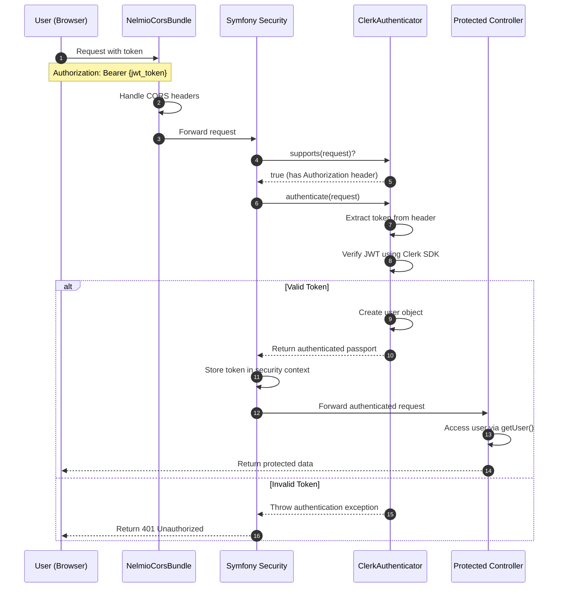

# Clerk Symfony Example

Integration of [Clerk](https://clerk.com/) authentication with Symfony 7 backend.

## Features

- JWT token validation
- Symfony security integration
- Protected API endpoints
- CORS support

## Project Structure

This Symfony 7 project consists of these key components:

- **ClerkAuthenticator** (`src/Security/ClerkAuthenticator.php`): Custom authenticator validating Clerk JWT tokens
- **Security Configuration** (`config/packages/security.yaml`): Configures security system to use the authenticator
- **ProtectedController** (`src/Controller/ProtectedController.php`): Contains API endpoints
- **CORS Configuration** (`config/packages/nelmio_cors.yaml`): Configures cross-origin resource sharing

## Authentication Flow



## How Authentication Works

1. Client obtains a JWT token from Clerk's frontend SDK
2. Client includes this token in the `Authorization` header when making requests
3. The `ClerkAuthenticator` validates the token using Clerk's PHP SDK
4. If valid, the authenticated user identity is made available to controllers
5. Protection is implemented through:
   - Access Control Lists in `security.yaml` for URL patterns
   - Method-level `#[IsGranted('IS_AUTHENTICATED_FULLY')]` attribute

## API Endpoints

- **GET /api/clerk-jwt**: Returns the user ID if authenticated
- **GET /api/get-gated**: Returns protected data (requires authentication)

## Setup

1. Install dependencies:
```bash
composer install
```

2. Configure in `.env.local`:
```
CLERK_SECRET_KEY=your_clerk_secret_key
CLERK_AUTHORIZED_PARTIES=http://localhost:5173
```

3. Start server:
```bash
symfony server:start
```

## Usage

From a React application:

```javascript
import { useAuth } from '@clerk/clerk-react';

function ApiExample() {
  const { getToken } = useAuth();
  
  const fetchData = async () => {
    if (getToken) {
      // Get the userId or null if the token is invalid
      let res = await fetch("http://localhost:8000/api/clerk-jwt", {
          headers: {
              "Authorization": `Bearer ${await getToken()}`
          }
      });
      console.log(await res.json()); // {userId: 'the_user_id_or_null'}

      // Get gated data or a 401 Unauthorized if the token is not valid
      res = await fetch("http://localhost:8000/api/get-gated", {
          headers: {
              "Authorization": `Bearer ${await getToken()}`
          }
      });
      if (res.ok) {
          console.log(await res.json()); // {foo: "bar"}
      } else {
          // Token was invalid
      }
    }
  };
  
  return <button onClick={fetchData}>Fetch Data</button>;
}
``` 