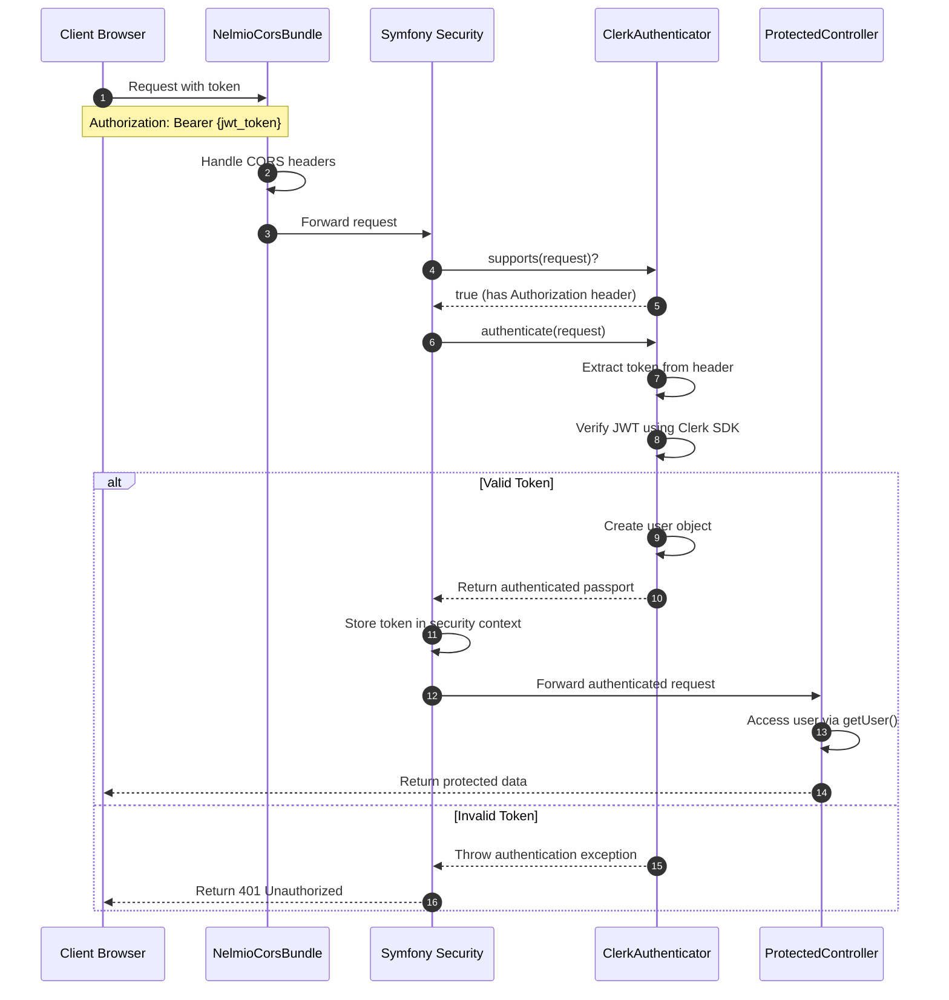

# Clerk Symfony Example

A demonstration of using Clerk JWT authentication with Symfony 7. This example shows how to integrate Clerk's user authentication with a Symfony backend API.

## Installation

After cloning this repository:

```bash
$ composer install
```

## Configuration

Set the required environment variables in your `.env.local` file:

```
CLERK_SECRET_KEY=your_clerk_secret_key
CLERK_AUTHORIZED_PARTIES=http://localhost:5173
```

The configuration is automatically loaded via `config/services.yaml`:

```yaml
App\Security\ClerkAuthenticator:
    arguments:
        $secretKey: '%env(CLERK_SECRET_KEY)%'
        $authorizedParties: '%env(CLERK_AUTHORIZED_PARTIES)%'
```

## Running

Start the Symfony development server:

```bash
$ symfony server:start
```

Or if you don't have the Symfony CLI:

```bash
$ php -S localhost:8000 -t public/
```

The API will be available at http://localhost:8000

## How It Works

Authentication flow:



## Frontend Integration

From a Clerk React frontend:

```javascript
import { useAuth } from '@clerk/clerk-react';

function ApiExample() {
  const { getToken } = useAuth();
  
  const fetchData = async () => {
    if (getToken) {
      // Get the userId or null if the token is invalid
      let res = await fetch("http://localhost:8000/api/clerk-jwt", {
          headers: {
              "Authorization": `Bearer ${await getToken()}`
          }
      });
      console.log(await res.json()); // {userId: 'the_user_id_or_null'}

      // Get gated data or a 401 Unauthorized if the token is not valid
      res = await fetch("http://localhost:8000/api/get-gated", {
          headers: {
              "Authorization": `Bearer ${await getToken()}`
          }
      });
      if (res.ok) {
          console.log(await res.json()); // {foo: "bar"}
      } else {
          // Token was invalid
      }
    }
  };
  
  return <button onClick={fetchData}>Fetch Data</button>;
}
```

## API Reference

Available endpoints:

- `GET /api/clerk-jwt` - Returns the authenticated user ID
- `GET /api/get-gated` - Returns protected data (requires authentication)

## Implementation Details

Key files:

- `src/Security/ClerkAuthenticator.php` - Handles JWT validation and authentication
- `src/Controller/ProtectedController.php` - Contains protected API endpoints
- `config/packages/nelmio_cors.yaml` - Manages CORS configuration
- `config/packages/security.yaml` - Configures security system and access control

## ⚠️ Production Warning

This project is not optimized for production and does not address all best practices that should be configured in a production app. It serves as a design template and should be given appropriate consideration before being used in production.

Issues to address for production use:
- CORS configuration is specific to development environments
- No HTTPS enforcement
- Minimal error handling (especially 401 errors)
- Using development server settings

For production deployment:
1. Configure proper CORS settings for your specific domains
2. Enforce HTTPS for all API communication
3. Implement comprehensive error handling
4. Use a production-grade web server instead of the built-in development server 